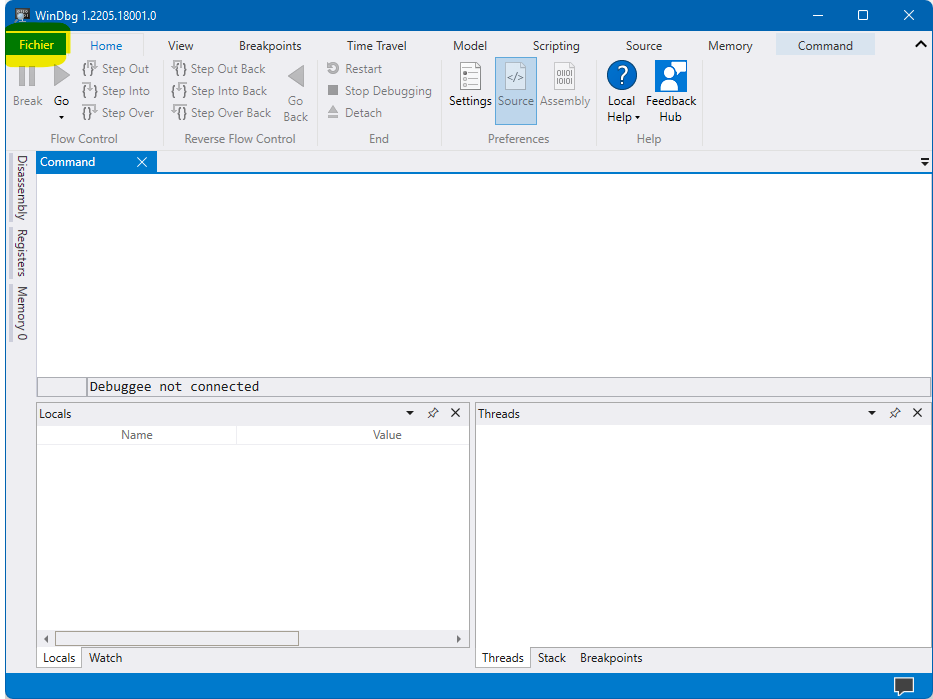
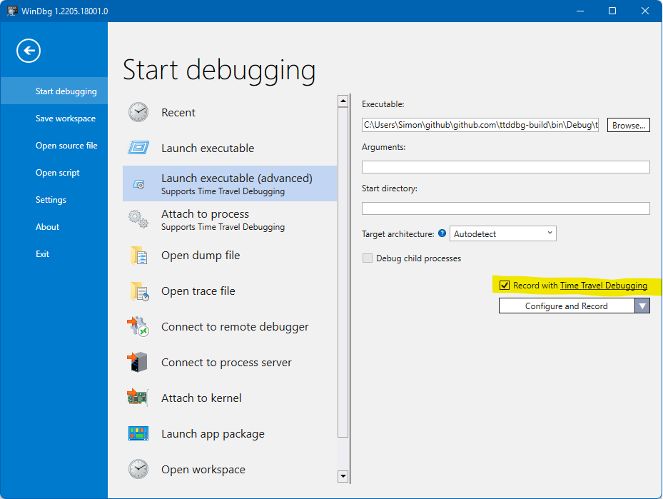
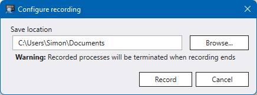

# Things to know before time traveling

There are two main points to consider, especially if you plan using time travel debugging to analyze malware.

## TTD relies on DLL injection

WinDBG will inject a DLL into the selected process, which may trigger anti-tampering features possibly implemented into the targeted program.

## Targeted program is freely executed

In order to record a trace, WinDBG allows the targeted program to run freely. Isolate the environment as appropriate!

# How to record a TTD trace using WinDBG

This short tutorial will guide you through using WinDBG to record a Time Travel Debugging trace to be used with this plugin.

You will need the following prerequisites:
- A copy of WinDBG Preview [[Microsoft Store link](https://apps.microsoft.com/store/detail/windbg-preview/9PGJGD53TN86)]
- A copy of the executable you are trying to debug

Then, open up WinDBG Preview and go to "File -> Launch executable (advanced)". Select your executable and make sure to enable "Record with Time Travel Debugging".

WinDBG will then ask you for a path to store the recording. You can store them wherever you want, but be aware that the recording is made up of three different files, and can quickly become significant in size.

Once this is done, click "Record".

WinDBG will then record the executable's actions and give you back control after some time. Once this is done, you can safely close WinDBG! Your recording will be in a `*.run` file in the folder you chose.
