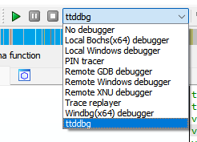

# ttddbg - Time Travel Debugging IDA plugin

**⚠️ Attention IDA 8 users: using ttddbg with IDA 8 require a work-around for the moment, see [Known issues](#known-issues)**

This plugin adds a new debugger to IDA which supports loading [Time Travel Debugging](https://docs.microsoft.com/en-us/windows-hardware/drivers/debugger/time-travel-debugging-overview) traces generated using WinDBG Preview.


This plugin supports both x86 and x64 traces, and by extension IDA and IDA64.

## Installation

Installing the plugin can be done using the installer from the [releases page](https://github.com/airbus-cert/ttddbg/releases). The installer will automatically install the required dependencies, provided you have a copy of [WinDBG Preview](https://apps.microsoft.com/store/detail/windbg-preview/9PGJGD53TN86) installed.

## Usage

Once installed, you can use the plugin by selecting the `ttddbg` debugger in the IDA interface, and specifying your `*.run` file as the "Application". For help on generating a `.run` file, see [`HOWTO_TIME_TRAVEL.md`](HOWTO_TIME_TRAVEL.md).




| Icon                                                        | Action                                                                                                             |
| ----------------------------------------------------------- | ------------------------------------------------------------------------------------------------------------------ |
|          | Go to previous breakpoint                                                                                          |
|          | Simulate a full run of the program                                                                                 |
|    | Single step backward (RIP - one instruction)                                                                       |
|          | Manage the timeline of interesting events (Threads Created/Terminated, Module Loaded/Unloaded, Exceptions, Custom) |
|    | Manage the currently traced functions                                                                              |
|  | View trace events                                                                                                  |

### Function tracing feature

Since version 1.1.0, ttddbg supports a new feature we call "function tracing". While in the debugging view, it is possible to mark functions for tracing by right-clicking them in the *Functions* or *Module* interfaces. Once a function is traced, any call to this function, and any `return` statement, will be recorded in the new *Trace events* window.

Using the function information from your reverse engineering work, ttddbg also extracts the parameters passed to the function as well as its return value. Symbols are automatically pretty-printed based on the information available to IDA, such as enum values.

## Known issues

- Using **IDA Pro 8.2** and this plugin leads to a crash when entering the debugger. This issue appears to be caused by an incompatibility between this plugin and the `picture_search` plugin, which is new in IDA 8. Removing `picture_search.dll` and `picture_search64.dll` from the `plugins` folder temporarily fixes this issue. The problem has been raised to Hex-Rays.

## Building the project

Prerequisites:

- A copy of the IDA SDK (available from the [download center](https://hex-rays.com/download-center/) using your IDA Pro credentials)
- A copy of `TTDReplay.dll` (usually in `C:\Program Files\WindowsApps\[WinDBG folder]\amd64\ttd\`)
- A copy of `TTDReplayCPU.dll` (usually in `C:\Program Files\WindowsApps\[WinDBG folder]\amd64\ttd\`)

And let CMAKE do its magic!

```console
$ git clone git@github.com:airbus-cert/ttddbg.git --recursive
$ mkdir build
$ cd build
$ cmake ..\ttddbg -DIDA_SDK_SOURCE_DIR=[PATH_TO_IDA_SDK_ROOT_FOLDER] -DCPACK_PACKAGE_INSTALL_DIRECTORY="IDA Pro 7.7"
$ cmake --build . --target package --config release
```

## Developer corner

To create a dev solution:

```console
$ git clone git@github.com:airbus-cert/ttddbg.git --recursive
$ mkdir build
$ cd build
$ cmake ..\ttddbg -DIDA_SDK_SOURCE_DIR=[PATH_TO_IDA_SDK_ROOT_FOLDER] -DBUILD_TESTS=ON
```

# Credits and references

Greetz to [commial](https://github.com/commial) for his work on [ttd-bindings](https://github.com/commial/ttd-bindings)!
